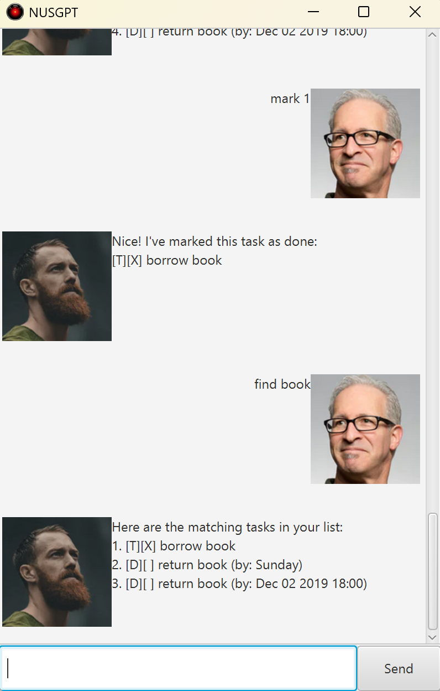

# NUSGPT User Guide



NUSGPT is the ultimate task handler! 

- text-based commands
- saves data locally to your computer
- *EASY* to use

***

## Features
- todo tasks with description
- deadline tasks with description and deadline
- event tasks with description, start time and end time
- delete tasks
- mark/unmark tasks
- list tasks
- find tasks with keyword
- help to show valid commands

## ToDo Task
Add a ToDo task to your task list.

Format: 'todo (description)'

Example input:
```
todo borrow book
```

Example output:
```
[T][ ] borrow book
```

## Deadline Task
Add a Deadline task to your task list.

Format: 'deadline (description) /by (date)'

Example input:
```
deadline return book /by 2/12/2019 1800
```

Example output:
```
[D][ ] return book (by: Dec 02 2019 18:00)
```

## Event Task
Add an Event task to your task list.

Format: 'event (description) /from (start date) /to (end date)'

Example input:
```
event project meeting /from Mon 2pm /to 4pm
```

Example output:
```
[E][ ] project meeting (from: Mon 2pm to: 4pm)
```

## Date Format
Dates for tasks can be stored as either text or the LocalDateTime format.

Valid date formats:
- yyyy/MM/dd
- yyyy/MM/dd HHmm
- dd/M/yyyy
- dd/M/yyyy HHmm

## Mark/Unmark Task
Marks/Unmarks a task from your task list.

Mark Format: 'mark (task index)'

Unmark Format: 'unmark (task index)'

Mark Example (ToDo task with index 1):

Input:
```
mark 1
```
Output:
```
[T][X] task
```

Unmark Example (ToDo task with index 1):

Input:
```
unmark 1
```
Output:
```
[T][ ] task
```

## Delete Task
Deletes a task from your task list.

Format: 'delete (task index)'

## List Tasks
Shows a list of all tasks in your task list.

Format: 'list'

## Find Tasks
Shows a list of all the tasks with the keyword in your task list.

Format: 'find (keyword)

## Help
Shows a list of all the valid commands and their formats.

Format: 'help'

## Bye
Stops the application.

Format: 'bye'